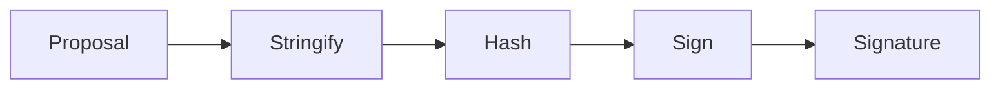

# Submit your proposal via the decentralized channel

### Signing
Prerequisites: Completed proposal object. See [models/proposal](models/project.json5).
- The proposal object must be hashed with [SHA-256](http://www.webtoolkit.info/javascript-sha256.html)
- The signature must be created with a Web3 compatible wallet using the [Ethereum standard](https://eips.ethereum.org/EIPS/eip-712#:~:text=The%20sign%20method%20calculates%20an,as%20an%20Ethereum%20specific%20signature.) for message signing

Confirm your grant proposal with your wallet signature. See the flowchart below.

_(Alternatively view [this file](examples/images/signing-flow.png) for a rendered diagram)_

Request in JSON format
```json5
{
  "proposal": { ... }, // [Object] Your proposal object.
  "signature": "0x3b4e9f517773be9a..." // [String] Ethereum EDCSA signature 
}
```